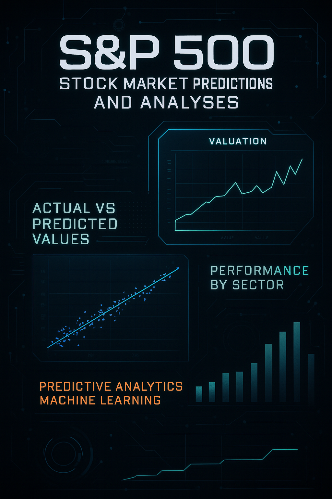

  

# 📈 S&P 500 Stock Market Predictions and Analyses

**Authors:** Francis Fynnwilliams & Keshav Nayyar

---

## 🧠 Introduction

The S&P 500, a benchmark index comprising 500 of the largest publicly traded companies in the U.S., is a vital barometer of economic and market health. This project investigates whether it's possible to predict future stock prices using historical S&P 500 data, while also analyzing sector-level performance using data science and machine learning techniques.

🔗 [Learn more about the S&P 500](https://www.investopedia.com/terms/s/sp500.asp)

---

## 📊 Data Source & Preparation

**Dataset:** [Kaggle S&P 500 5-Year Data](https://www.kaggle.com/datasets/camnugent/sandp500)  
**Size:** 619,000+ rows (Open, High, Low, Close, Volume, Ticker Symbol)  
**Steps Taken:**
- Removed missing data
- Filtered out outdated tickers
- Merged with sector classification CSV
- Cleaned and formatted for machine learning and statistical analysis

---

## 📈 Exploratory Data Analysis

### Key Descriptive Stats:
- **Mean Price:** ~$83
- **Max Volume:** 618M shares
- **Tickers:** 500 stocks, 1,259 trading days

### Volatility Overview:
- **Highest:** PCLN, AMZN, GOOGL
- **Lowest:** AES, PBCT, NWS

---

## 🧪 Statistical Testing

### ✅ Chi-Square Test
**Question:** Is there a relationship between sector and volatility?  
**Result:** p = 0.058 → *Not statistically significant (but close)*

### ✅ Z-Test
**Goal:** Difference in mean returns between high and low volatility groups (per sector)  
**Significant Sectors:**
- **Consumer Discretionary** (p = 0.006)
- **Consumer Staples** (p = 0.0036)

Others showed no significant deviations.

### ✅ ANOVA Test
**Goal:** Are sector-level daily returns significantly different?  
- **F-Statistic:** 0.733  
- **p-Value:** 0.623 → *No significant difference*

---

## 🤖 Machine Learning Model

### Features Used:
- Previous closing price
- 5-day and 30-day moving averages
- 5-day volatility
- 5/30 average ratio
- Previous day return

### Neural Network Structure:
- Input: 6 features
- Layers: 64 → 32 → 1 neurons (ReLU)
- Optimizer: Adam
- Loss Function: Mean Squared Error (MSE)

### Training Results:
- **Epochs:** 25
- **Final Validation MSE:** 0.00056  
- **Loss Trend:** Training and validation loss decreased steadily

---

## 🔍 Prediction Accuracy

- Predictions closely follow actual values for most stocks
- High accuracy in low-to-mid price range
- Few outliers at higher price ranges
- Visualization: Predicted vs. Actual Scatter Plot shows tight diagonal clustering

---

## 🧠 Insights & Conclusions

### Predictive Modeling
- Neural network accurately predicts prices using engineered features
- Especially strong performance with low-volatility stocks

### Sector Analysis
- **Outperformers:** Consumer Discretionary, Consumer Staples
- **Stable Sectors:** Finance, Industrial, Technology
- No inherent relationship between sector and volatility

### Stakeholder Implications
| Group           | Key Benefit |
|----------------|-------------|
| **Investors**  | Smarter portfolio allocation based on risk/return |
| **Economists** | Insight into sector resilience |
| **Data Scientists** | Validates deep learning in financial prediction |

---

## 📚 Resources

- [S&P 500 Explained – Investopedia](https://www.investopedia.com/terms/s/sp500.asp)  
- [Statistical Analysis – Simplilearn](https://www.simplilearn.com/what-is-statistical-analysis-article)  
- [Regression in Machine Learning – BuiltIn](https://builtin.com/data-science/regression-machine-learning)  
- [ReLU Activation – Mastery Guide](https://machinelearningmastery.com/rectified-linear-activation-function-for-deep-learning-neural-networks)  
- [Mean Squared Error (MSE)](https://builtin.com/machine-learning/loss-functions)  
- [Sector Research – S&P Global](https://www.spglobal.com/spdji/en/documents/research/research-the-impact-of-the-global-economy-on-the-sp-500.pdf)

---

## 💡 Final Thoughts

This project bridges the gap between academic data science and real-world financial analytics. It validates the use of neural networks in financial prediction and highlights the need to account for volatility, sector dynamics, and macroeconomic influences.

> “Past trends can inform the future, but prediction without context is noise.”

---